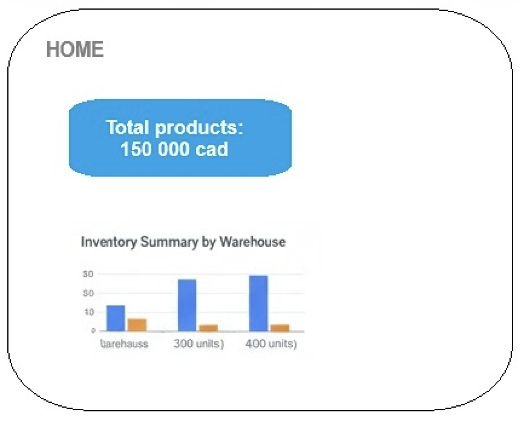
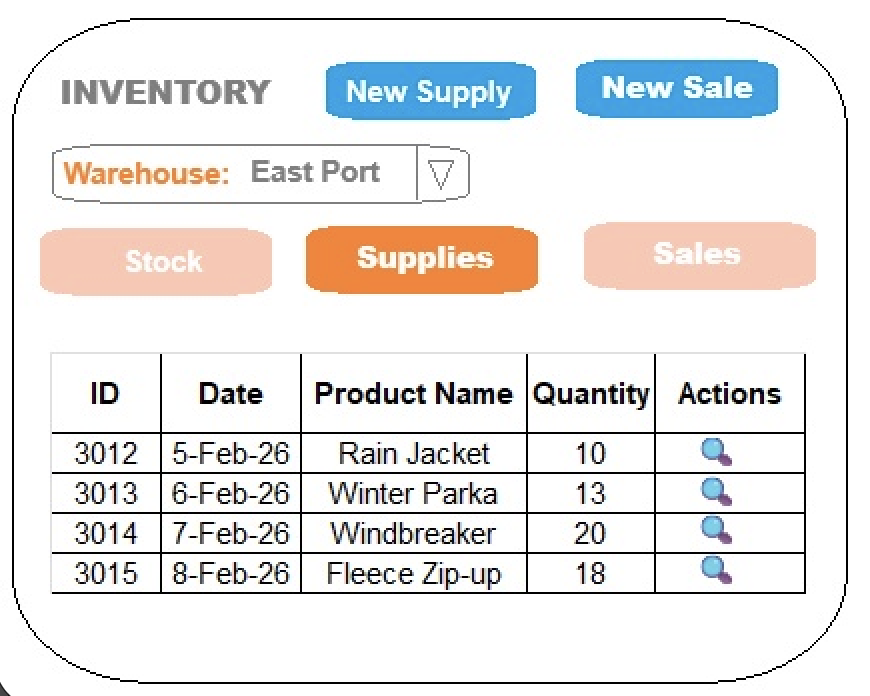
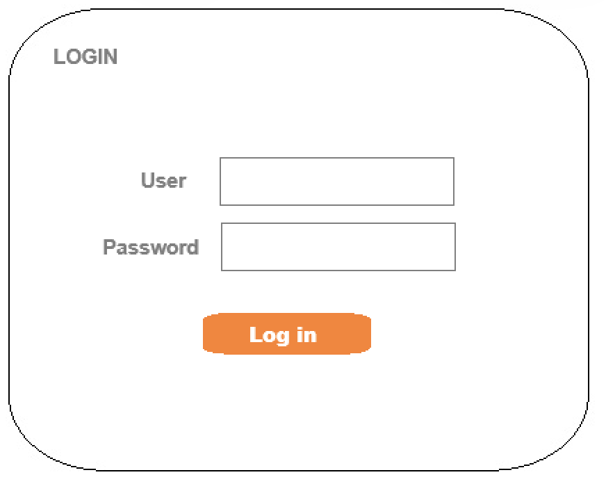
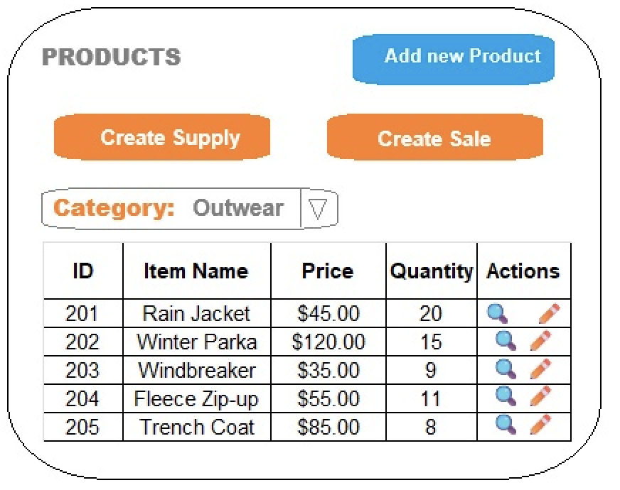
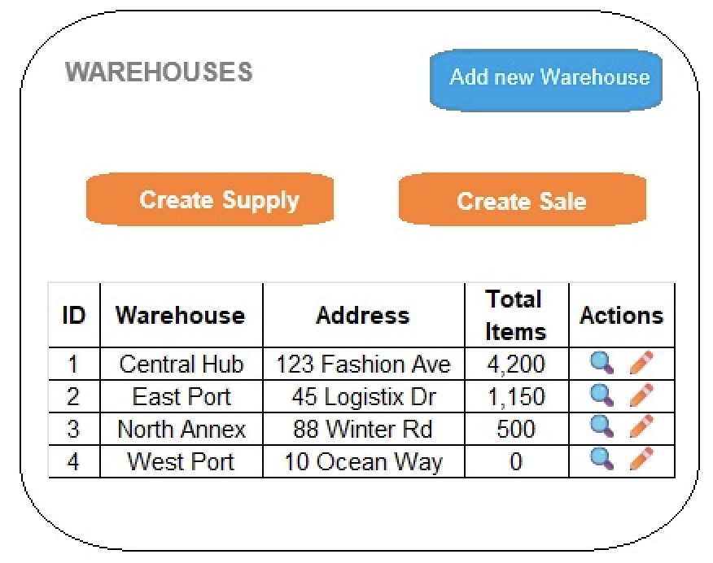

# 404 Found

## Group 
  - **404 Found**

## Members 
  - **[Iuliia Bazhutina](https://github.com/IuliiaBazhutina)**
    - 
  - **[Michael Newman](https://github.com/NewMicRob)**
    -

## Adventure of choice
  - Category 1: E-Commerce Platform (eg: Clothes Warehouse) 
    - Scenario: Build an inventory management system for a fashion warehouse with multi-location distribution(it doesn't have to be fashion). 
    - Core Domain: Item (product), Brand, Inventory, Distribution Centre 
    - Why Choose This: Traditional business domain with clear CRUD operations and real-world complexity.

## Project Overview  
- (OUR WEBSITES NAME) is an e-commerce website that will incorporate a inventory management system accross multiple warehouses. That updates stock actively and notifies the admins dashboard when an item needs to be reordered.
- (OUR WEBSITE NAME) will incorporate being able to update product info, create new product, shift stock, delete stock, delete products, generate reports for the admin, and use security for user login.

## Core Concepts  
- Admin creates a product
- Product popultes the inventory of a selected warehouse
- The product is available to order by customers
- The product can be actively managed to keep stock consistant accross warehouses
- A report will generate for when the admin logs in to let them know what warehouse needs stock, where it can be procured from, and if it needs to be ordered from a distributer.
- The Manager can request stock of items and the Admin can accept with the click of a button.

## Domain
  - Product
  - Brand
  - Category
  - Warehouse
  - Inventory
  - Product Supply
  - Product Sale
  - Customer
  - Supplier

## Diagram
> [!IMPORTANT]
> 

## Roles and Access
| Role   | Can Purchase Product | Can Manage Inventory | Can Approve Requests | Can Make Requests |  
| :---   |         :---:        |        :---:         |         :---:        |            ---:   |
|Customer|           X          |                      |                      |                   |
|Manager |                      |                      |                      |          X        |
|Admin   |                      |          X           |           X          |                   |
    
## UI Layout
**Home**  
    - Shows Summary  
**Product View**  
    - Searchable table, that displays all items  
**Warehouse**  
    - Allows for searches based on warehouse selected.  
**Login Page**  
    - Security to allow management of the system  

## Home/Dashboard (Public Page)
> [!IMPORTANT]
> 

## Inventory (Manager and Admin)
> [!IMPORTANT]
> 

## Login (Public Page)
> [!IMPORTANT]
> 

## Products (Admin)
> [!IMPORTANT]
> 

## Warehouse (Admin)
> [!IMPORTANT]
> 

## Tech Stack
  **Languages:** Spring, Java, HTML  
  **Build:** Maven  
  **UI:** Bootstrap CSS, and Thymeleaf  

## How To Run
  ### Environment  
  **JDK:** Java 25  
  **Build:** Maven  
  
1. **Clone:** `git clone https://github.com/NewMicRob/404-Found-CPAN-228-Group-Assignment.git`
2. **Open the Folder**
3. **Run:** Application.java
4. **Go to:** [http://localhost:8080](http://localhost:8080)
