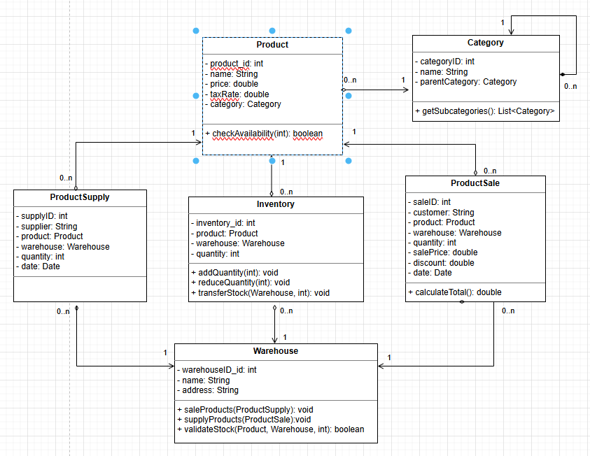
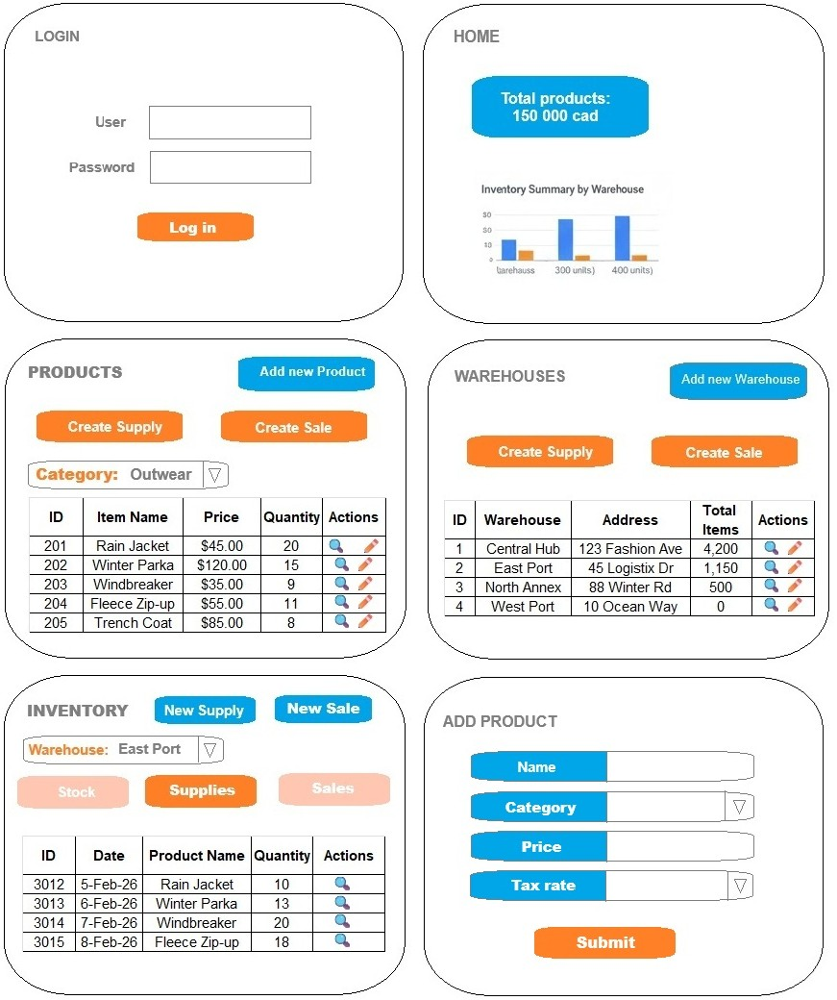

# 404 Found

## Group 
  - **404 Found**

## Members 
  - **[Iuliia Bazhutina](https://github.com/IuliiaBazhutina)**
    - 
  - **[Michael Newman](https://github.com/NewMicRob)**
    -

## Adventure of choice
  - Category 1: E-Commerce Platform (eg: Clothes Warehouse) 
  - Scenario: Build an inventory management system for a fashion warehouse with multi-location distribution(it doesn't have to be fashion). 
  - Core Domain: Item (product), Brand, Inventory, Distribution Centre 

## Project name
  - StockFlow

## Why we chose this progect
  - StockFlow is a traditional business domain with clear CRUD operations and real-world complexity.

## Project Overview  
  - StockFlow is an e-commerce website that will incorporate an inventory management system accross multiple warehouses. 
  - StockFlow will incorporate being able to create new products and warehouses, register product supplies and sales, check and update product inventory, generate reports.

## Core Concepts  
  - The Admin creates products, warehouses, and initial inventory as of the app’s start date.
  - Users (Warehouse Workers) record all product supplies and sales, keeping stock consistent across warehouses.
  - Users can check the inventory of a specific product or view products by category.
  - Users can generate a report of all products in a selected warehouse.
  - Users can view the total inventory across all warehouses on the Home page.
  - Users can create customized inventory reports using various filters.

## Domain
  - Product
  - Category
  - Warehouse
  - Inventory
  - Product Supply
  - Product Sale

## Diagram
> [!IMPORTANT]
> 

## Roles and Access

| Role  | Can View Product Stock & Generate Reports | Can Manage Inventory | Can Create & Update Products / Warehouses |
|-------|-------------------------------------------|----------------------|-------------------------------------------|
| Admin | Yes                                       | Yes                  | Yes                                       |
| User  | Yes                                       | Yes                  | No                              
    
## UI Layout
### Login Page
* Provides secure user authentication to access the system.
### Home
* Shows a summary of product stock across all warehouses.
### Products
* Displays a searchable table of all products.
### Warehouses
* Allows to search and view information based on the selected warehouse.
### Inventory
* Allows users to manage and update product inventory.
### Add New Product
* Provides a form to add a new product.

## UI WireFrame
> [!IMPORTANT]
> 

## Tech Stack
  **Languages:** Spring, Java, HTML  
  **Build:** Maven  
  **UI:** Bootstrap CSS, and Thymeleaf  

## How To Run
  ### Environment  
  **JDK:** Java 25  
  **Build:** Maven  
  
1. **Clone:** `git clone https://github.com/NewMicRob/404-Found-CPAN-228-Group-Assignment.git`
2. **Open the Folder** `cd 404-Found-CPAN-228-Group-Assignment/`
3. **Run:** Application.java
4. **Go to:** [http://localhost:8080](http://localhost:8080)
